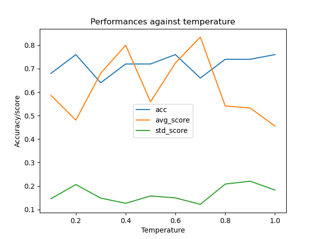
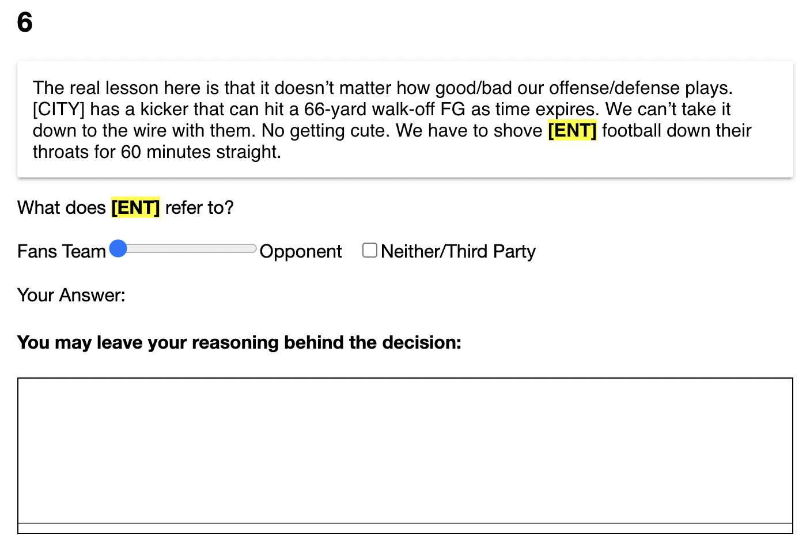

This week I tested on how temperature impacts the gpt annotation performance. I maneuvered the temperature form 0.1 to 1.0. The following figure plots the data(score is the kohen kappa score), from which I observe that no optimal temperature works best for the gpt annotation.

Meanwhile, this week I modified the MTurk once more with following features:
1). participants now need to choose either a checkbox, which says third-party, or a slider, which means either in or outgroup. The slider has five level from fan's team, likely fan's team, either, likely opponents' team, to opponents' team.
2). there's a text box under each comment so that participants now can voluntarily leave their reasoning behind the answer.
3). every masked entity is a forced question, so participants must finish labeling all the comments to submit the answer.
4). replace the city name with [CITY] and name with [NAME].

All four members in the lab tried on this updated task. Since there are multiple candicate choices (6 of them) in this task, calulating the accuracy is a trickier task. But in general people did poorly on this task with the fleiss kappa score being 0.22. However, we need to devise a wiser metrics for calculating the accuracy. Binarizing the slider might be a good idea.
